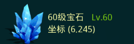

# Coordinate for District 401

## 原理

### 基本概念

提取矿标的过程就是数据分析过程，必须要理解数据。数据分为以下几种：

1) 原始数据 - 即在Windows上支持Android模拟器，通过自动化截图工具(脚本)截下来的bmp格式的图片.

2) 基础数据 - 我们感兴趣的矿标，比如级别大于58级的矿标. 有了这些基本数据后，我们才能进行后续的扫矿操作。


## 数据收集：

**1) 获取原始数据**

在Android模拟器上运行游戏，再通过自动化工具遍历每个矿的坐标，如果坐标为矿，则将其对应的信息截图，例如：


**2) 生成基础数据**

有了原始矿标的截图信息后，利用OCR技术，提取图中的数字和文字信息。这一步主要通过[search_mine.sh](search_mine.sh)脚本完成。

### 漏报说明：

  由于截图和图像识别的不稳定等因素，这里列出的坐标难免会有遗漏。漏报包括以下方面：

  * 截图误差 - 由于网络不稳定，导致一些图没有截下来。或者，在截图中产生的一些系统信息导致截图模糊，也会影响识别的效果。
  * OCR识别准确度 - 在对数字识别时，有时会将6识别成5，将8识别成3，在观察了一部分样本后，脚本最大可能的修正了数据。

  补救措施，将漏报的矿标手动加到[userdata.txt](userdata.txt)文件中，运行[remedy](remedy)脚本即可

    ``` userdata.txt
        0,6,60,硅
        0,29,60,硅
        0,383,60,硅
        0,449,60,硅
        0,453,60,硅
    ```

## 使用数据：

一般情况下，我们没必要使用全部的基础数据，那样的话，数据量太大，搜索时间也会更长。[extract.py](extract.py)工具可以指定矿的类别，矿的级别，地图的大致范围搜索，得到一个小范围的数据。如下所示，找在坐标1,101，距离在50内的所有大于60级的硅矿。

    $ ./extract.py -ge 62 -xy 1 101 -d 50 -t 硅
    22 78
    13 64
    14 66
    31 97
    1 101
    -1 -1


## 坐标数据

我们只关心58级以上矿的坐标，以下链接列出的匀是58级以上的矿标。坐标x每10个区间存一个文件，如下0-9代表x为0至9所有的坐标。文件中的一行代表矿的x坐标，y坐标，level级别，type类型（铁, 铜, 油, 硅, 宝石）


|x|count|x|count|x|count|
|----|----|----|----|----|----|
|[0-9](result/0-9.csv)|183|[10-19](result/10-19.csv)|243|[20-29](result/20-29.csv)|201|
|[30-39](result/30-39.csv)|187|[40-49](result/40-49.csv)|218|[50-59](result/50-59.csv)|224|
|[60-69](result/60-69.csv)|210|[70-79](result/70-79.csv)|181|[80-89](result/80-89.csv)|214|
|[90-99](result/90-99.csv)|231|

--------


sssss

|xyszss|slek|
|----|------|
|xxdd|fffeee|
